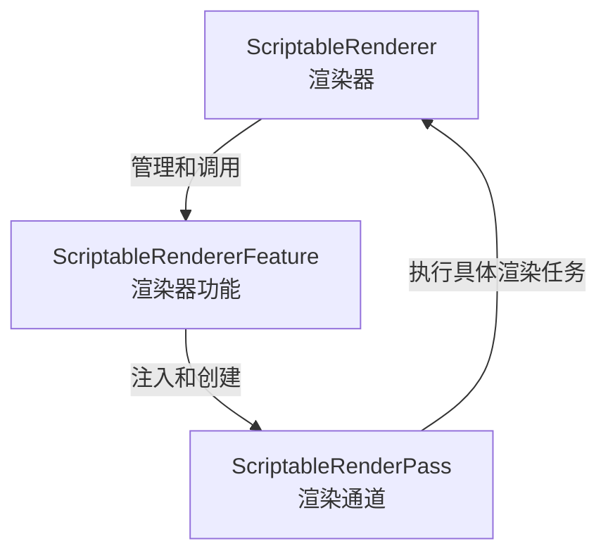

# URP 自定义拓展详解

---

#### 1. ScriptableRenderer, ScriptableRendererFeature, ScriptableRenderPass, 这三者是怎样的抽象关系？

简略示意图如下：



### 1. **ScriptableRenderer（脚本化渲染器）**

- **定位**：渲染管线中的核心组件，负责管理整个渲染过程。
- **职责**：
  - 管理渲染流程和状态。
  - 控制渲染通道（Render Pass）的执行顺序。
  - 维护渲染目标（Render Targets）和渲染上下文。
- **抽象层级**：最高层，是渲染的“指挥者”或“总控”。

------

### 2. **ScriptableRendererFeature（脚本化渲染器功能）**

- **定位**：一种插件式的扩展机制，可以挂载到 `ScriptableRenderer` 上。
- **职责**：
  - 提供一种方便的方式向渲染器注入新的渲染通道（`ScriptableRenderPass`）。
  - 可以包含一个或多个渲染通道。
  - 用于组织和管理具体的渲染功能，比如自定义的后处理效果、特殊光照等。
- **抽象层级**：中间层，负责扩展渲染器功能，类似“功能模块”或“插件”。

------

### 3. **ScriptableRenderPass（脚本化渲染通道）**

- **定位**：渲染流程中的最小逻辑单元。
- **职责**：
  - 定义具体的渲染操作（如绘制物体、执行后处理、清除目标等）。
  - 配置渲染目标，发出绘制命令。
  - 可以理解为“一次具体的渲染任务”。
- **抽象层级**：最底层，负责具体执行渲染指令。

------

### 三者的关系总结

- `ScriptableRenderer` 是渲染管线的核心，负责整体渲染控制。
- `ScriptableRendererFeature` 作为功能扩展点，向渲染器添加新功能。
- `ScriptableRendererFeature` 通过创建和注入 `ScriptableRenderPass` 来实现具体的渲染逻辑。
- 换句话说：
  - **渲染器**管理整个渲染流程；
  - **渲染器功能**是插件，负责扩展渲染器；
  - **渲染通道**是具体的执行单元，完成实际的渲染任务。

---

```c#
using UnityEngine;
using UnityEngine.Rendering;
using UnityEngine.Rendering.Universal;

namespace Arts.Scripts.Core
{
    /// <summary>
    /// 你可以将一个 <c>ScriptableRendererFeature</c> 添加到 <c>ScriptableRenderer</c> 中。
    /// 使用此可编写脚本的渲染器功能向渲染器注入渲染通道。
    /// </summary>
    /// <seealso cref="ScriptableRenderer"/>
    /// <seealso cref="ScriptableRenderPass"/>
    public class CustomRenderPassFeature : ScriptableRendererFeature
    {
        /// <summary>
        /// <c>ScriptableRenderPass</c> 实现了一个逻辑上的渲染通道，可用于扩展 Universal RP 渲染器。
        /// </summary>
        class CustomRenderPass : ScriptableRenderPass
        {
            /// <summary>
            /// 这个方法会在执行渲染通道之前被调用。
            /// 可以用来配置渲染目标及其清除状态，也可以用来创建临时的渲染目标纹理。
            /// 如果这个方法留空，则该渲染通道将渲染到当前激活的摄像机的渲染目标上。
            /// 你不应该直接调用 CommandBuffer.SetRenderTarget。应使用 <c>ConfigureTarget</c> 和 <c>ConfigureClear</c> 方法。
            /// 渲染管线将确保以高效的方式进行渲染目标的设置和清除。
            /// </summary>
            /// <param name="cmd"></param>
            /// <param name="renderingData"></param>
            public override void OnCameraSetup(CommandBuffer cmd, ref RenderingData renderingData) {
                
            }

            /// <summary>
            /// 你可以在这里实现渲染逻辑。
            /// 使用 <c>ScriptableRenderContext</c> 来发出绘制命令或执行命令缓冲区。
            /// 参考：https://docs.unity3d.com/ScriptReference/Rendering.ScriptableRenderContext.html
            /// 你不需要手动调用 ScriptableRenderContext.submit，渲染管线会在管线的特定阶段自动调用它。
            /// </summary>
            /// <param name="context"></param>
            /// <param name="renderingData"></param>
            public override void Execute(ScriptableRenderContext context, ref RenderingData renderingData) {
                // Blitter.BlitCameraTexture();
            }

            /// <summary>
            /// 清理在执行此渲染通道过程中分配的任何资源。
            /// </summary>
            /// <param name="cmd"></param>
            public override void OnCameraCleanup(CommandBuffer cmd)
            {
            }

            /// <summary>
            /// 该方法在执行渲染通道之前由渲染器调用。
            /// 如果你需要配置渲染目标及其清除状态，或创建临时的渲染目标纹理，请重写此方法。
            /// 如果渲染通道未重写此方法，则默认渲染到当前激活摄像机的渲染目标。
            /// 不应直接调用 CommandBuffer.SetRenderTarget，而应使用 <c>ConfigureTarget</c> 和 <c>ConfigureClear</c>。
            /// </summary>
            /// <param name="cmd">用于加入渲染命令的 CommandBuffer，这些命令将由渲染管线执行。</param>
            /// <param name="cameraTextureDescriptor">摄像机渲染目标的渲染纹理描述符。</param>
            /// <seealso cref="ConfigureTarget"/>
            /// <seealso cref="ConfigureClear"/>
            public override void Configure(CommandBuffer cmd, RenderTextureDescriptor cameraTextureDescriptor) {
                cmd.GetTemporaryRT(Shader.PropertyToID("test"), cameraTextureDescriptor);
            }

            /// <summary>
            /// 在摄像机栈渲染完成后调用。你可以在这个回调中释放该渲染通道创建的、需要在所有摄像机渲染完成后清理的资源。
            /// 此方法会在摄像机栈中最后一个摄像机渲染完成后调用一次。
            /// 没有显式摄像机栈的摄像机也被视为栈式渲染，此时 Base 摄像机既是栈中的第一个也是最后一个摄像机。
            /// </summary>
            /// <param name="cmd">使用该 CommandBuffer 来清理所有生成的数据。</param>
            public override void OnFinishCameraStackRendering(CommandBuffer cmd) {
            
            }
        }

        CustomRenderPass m_ScriptablePass;
    
        
        /// <summary>
        /// 初始化该渲染器功能的资源，该方法在每次序列化发生时都会被调用一次。
        /// </summary>
        public override void Create()
        {
            m_ScriptablePass = new CustomRenderPass();

            // 配置该渲染通道应注入到渲染管线的哪个位置。
            m_ScriptablePass.renderPassEvent = RenderPassEvent.AfterRenderingOpaques;
        }
    
        /// <summary>
        /// 你可以在这里向渲染器中注入一个或多个渲染通道。该方法在每个摄像机设置渲染器时被调用一次。
        /// </summary>
        /// <param name="renderer"></param>
        /// <param name="renderingData"></param>
        public override void AddRenderPasses(ScriptableRenderer renderer, ref RenderingData renderingData) {
            
            // 一个结构体，用于扁平化多个用于渲染摄像机栈的渲染设置。
            // URP 从多个来源构建 <c>RenderingData</c> 设置，包括管线资产（Pipeline Asset）、摄像机和光照设置。
            // 这些设置在不同平台上可能会有所不同，并可能受到是否启用自适应性能（Adaptive Performance）的影响。
            // RenderingData data;
            
            renderer.EnqueuePass(m_ScriptablePass);
        }

        /// <summary>
        /// 在渲染器进行裁剪之前的回调。
        /// </summary>
        /// <param name="renderer">触发回调的渲染器。</param>
        /// <param name="cameraData">CameraData 包含该摄像机所有相关的渲染目标信息。</param>
        public override void OnCameraPreCull(ScriptableRenderer renderer, in CameraData cameraData) {
        
        }

        /// <summary>
        /// 在渲染目标初始化完成后的回调。允许在渲染目标创建并准备就绪后从渲染器中访问它们。
        /// </summary>
        /// <param name="renderer">用于添加渲染通道的渲染器。</param>
        /// <param name="renderingData">渲染状态。使用它来设置渲染通道。</param>
        public override void SetupRenderPasses(ScriptableRenderer renderer, in RenderingData renderingData)
        {
        
        }
    
    }
}
```

